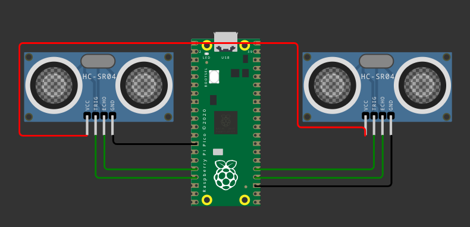

# Exe2 



Neste exercício, você deve desenvolver um firmware que:

- Faz a leitura de dois sensores SR-04 e imprime na tela o valor da distancia.

**Detalhes de funcionalidade:**

- Ler o sensor 1 e imprimir no terminal o valor em cm
- Ler o sensor 2 e imprimir no terminal o valor em cm
- Detectar falha em qualquer sendor e imprimir no terminal.

O valor no terminal deve ser explicitamente nesse formato:

```
Sensor 1 - dist: 22 cm
Sensor 2 - dist: 40 cm
Sensor 1 - dist: 22 cm
Sensor 2 - dist: 40 cm
Sensor 1 - dist: 22 cm
Sensor 2 - dist: 40 cm
```

Ou se quando houver falha:

```
Sensor 1 - dist: falha
Sensor 2 - dist: falha
```

**Detalhes do firmware:**

- Baremetal sem RTOS)
- Deve trabalhar com interrupções em todos os pinos
- Não é permitido usar `gpio_get()`.
- Ler a distancia 
- Identificar falhas

Calcular a distância em inteiro:

``` c
int distancia_1 = (int) ((dt_1 * 0.0343) / 2.0);
```

Imprimir o valor usando:

``` c
printf("Sensor 1 - %d cm\n", dt_1);
```
